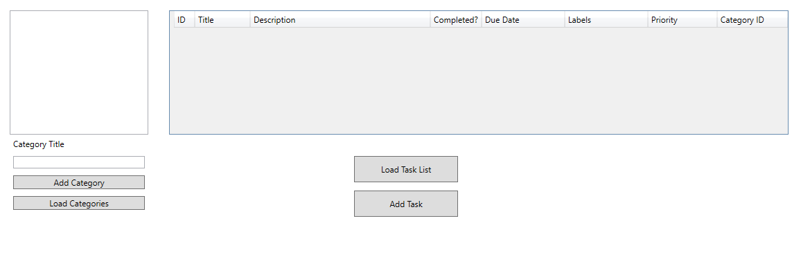
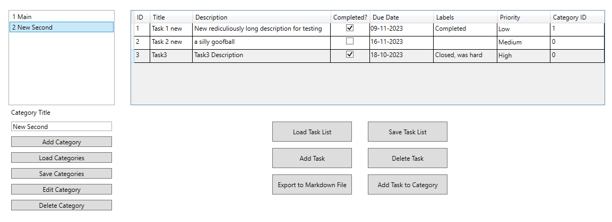

## D101 Programming Assignment

Created by Patrick 2023©️

#### How to use

To run this project:
1. You need to go into the folder `"D101 Assignment"\app`
2. Open Terminal/Command Prompt/Powershell in the folder
3. Run the command `dotnet run` 

Link to [testing](#testing) guide

The follwowing arguments are valid to use with this project:
- `donet run cli`  This will run the Command Line Interface version of the application

#### Workspace
| Folder/File Name | Functionality |
| - | - |
| [README.md](README.md) | Guide on how to use this Application |
| [\app](app) | Contains the main application (CLI and GUI) |
| [\test](test) | Contains the testing enviroment |
| [\imgs](imgs) | Contains the images for the README |

| */app* Folder | Functionality |
| - | - |
| [App.xaml](app\App.xaml)  ([App.xaml.cs](app\App.xaml.cs))  | WPF Project core functionality |
| [classes.cs](app\classes.cs) | Contains all Classes and methods used by both CLI and WPF |
| [MainWindow.xaml](app\MainWindow.xaml)   ([MainWindow.xaml.cs](app\)MainWindow.xaml.cs)) | WPF files for the GUI portion of the project | 
| [/stores](stores) | Folder used to store files for the CLI portion of the application |
| [/CLI/cli.cs](app\CLI\cli.cs) | Main file used to run the CLI portion of the project |

#### Domain Model (Code is stored in Classes.cs File)

| Class Name | Properties |
| - | - |
| Todo | ID, Title Description |
| TaskItem | DueDate, CompletedFlag, Labels, Priority, CategoryID + Inherited Properties of Todo |
| Category | ID, CategoryTitle |

The ID's of Todo and Category Classes both have auto incrimental methods inside so when the contructor is called to create a new Object of either Todo or Category the user does not have to input an ID.

### CLI 
To run the CLI run the project with the argument `cli` like `dotnet run cli`.
The application will Automatically load any existing TaskItem's or Category's from the `app\stores` folder
Once the application is loaded and running a textbased menu will appear with your options to List, Delete, and Create TaskItem or Category objects. You also have the option to save the current Category's and TaskItem's to your computers disk.

**PLEASE NOTE THAT EXITING THE APPLICATION WITHOUT SAVING WILL RESULT IN A LOSS OF ALL CHANGES DONE INSIDE THE CLI APPLICATION**

### GUI

To run the GUI portion of the application you just need to run `dotnet run` in the directory of the project.

Once booted you will see the application window appear like this:

You can add your own new Categories and TaskItems into their respective lists, or open a csv file in which some have been saved.

Once there are Categories and Tasks loaded or created then more options will appear, as you also select items even more buttons will appear. 

This picture displays all the button controls available:

Below each List contains controls where you can delete/add/load/save records. 
Only the Category List has an edit button as in the Task List you can click on the column you wish to edit. (Task's ID and Category ID column's are not editable via the list)

##### Category Controls

> - Add Category Button - Adds a new Category with a default name
>- Load Category Button - Prompts the user to find a CSV file to load Categories from  
> When the Category List contains 1 or more Category Objects in it, then the "Save Categories" button will appear.
>- Save Categories Button -  will prompt you to save the Category List as a CSV in a location of your choice
>On Selection of a Category the following buttons are displayed
>- Edit Category Button - To edit a Category, select it first, then edit the textbox under Category Title. Once you have a Title you want click the Edit Category Button and it will update that Category
>- Delete Category Button - Will delete the selected Category

##### Task List Controls
> - Load Task List Button - Loads a Task List saved as a CSV that the user selected on their comptuer
> - Add Task Button - Adds a new default Task 
>  When Task List contains more than one Task
> - Save Task List Button - Saves the Task List as a CSV file on the computer where the user selects
>  When Task List and Category List contain more than 1 record
>- Export to Markdown File Button - Exports the Task List with Category ID column replaced with the Category Title of the Category that matches that ID. The data is formatted into a Markdown table format.
>  If a Task is selected
>- Delete Task Button - Deletes the selected Task
>  If a Task and Category is Selected
>- Add Task to Category Button - Will change the Category ID field in the Task to equal that of the selected Category's ID.

### Testing
To launch the testing of the project navigate to the `"D101 Assignment"\test` folder and run `dotnet test`
This will test all core functional scripts:
1. TaskItem Creation
1. TaskItem Auto Incrimenting
1. Category Creation
1. Category Auto Incrimenting
1. TaskItem List Saving to CSV, and Loading
1. Category List Saving to CSV, and Loading

All these have been tested to show that the program runs successfully

### Known Bugs

#### Bug #1
>When editing the Due Date of a TaskItem/Task in the GUI if a Date is not picked an error will be thrown. (This error doesn't effect the GUI functionality or display, it was just presented in Visual Studio)

#### Bug #2
>After modifing the Task List in the GUI (i.e Adding a record) before loading a Task List CSV file can cause the Task List loading function to break. Unknown error which is caused by a System IO exception. User can fix this issue by restarting the application.

